# Agent Framework Diagrams

This document contains various Mermaid diagrams for the Agent Framework project.

## 1. Use Case Diagram

## 2. Class Diagram

## 3. Package Diagram

## 4. Sequence Diagram - Basic Agent Flow

## 5. Sequence Diagram - Agent with Thread and Tools

```mermaid
sequenceDiagram
    participant User
    participant main
    participant ChatAgent
    participant Thread
    participant WeatherTool as get_weather tool
    participant AzureAI as Azure AI Service
    
    User->>main: Run script
    main->>ChatAgent: Create agent (tools=get_weather)
    activate ChatAgent
    
    main->>ChatAgent: get_new_thread()
    ChatAgent->>Thread: Create new thread
    activate Thread
    Thread-->>ChatAgent: Return thread
    deactivate Thread
    ChatAgent-->>main: Return thread
    
    main->>ChatAgent: run("Write book about Belfast", thread)
    ChatAgent->>AzureAI: Send prompt + available tools
    activate AzureAI
    AzureAI-->>ChatAgent: Request tool call (get_weather)
    deactivate AzureAI
    
    ChatAgent->>WeatherTool: get_weather("Belfast")
    activate WeatherTool
    WeatherTool-->>ChatAgent: "Weather is cloudy, 15°C"
    deactivate WeatherTool
    
    ChatAgent->>AzureAI: Send tool result
    activate AzureAI
    AzureAI-->>ChatAgent: Complete response with weather
    deactivate AzureAI
    
    ChatAgent->>Thread: Store message
    ChatAgent-->>main: AgentResponse (book)
    
    main->>ChatAgent: run("Summarize in 5 points", thread)
    ChatAgent->>Thread: Get conversation history
    activate Thread
    Thread-->>ChatAgent: Previous messages
    deactivate Thread
    
    ChatAgent->>AzureAI: Send with context
    activate AzureAI
    AzureAI-->>ChatAgent: Summary response
    deactivate AzureAI
    
    ChatAgent->>Thread: Store message
    ChatAgent-->>main: AgentResponse (summary)
    deactivate ChatAgent
    
    main->>User: Display results
```

## 6. Activity Diagram - Agent Execution Flow

## 7. State Diagram - Agent Lifecycle

## 8. Component Diagram

## 9. Block Diagram - System Architecture

